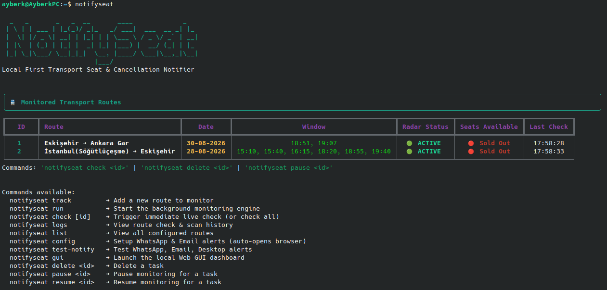

# NotifySeat

NotifySeat is a lightweight, local-first background radar that tracks TCDD train ticket cancellations. When trains are sold out, NotifySeat watches the availability in the background and alerts you the moment another passenger cancels their ticket and a seat opens up.

---

## Why NotifySeat?

Popular routes—especially high-speed trains like TCDD YHT between Istanbul and Ankara—frequently sell out days in advance. However, passengers cancel or change their tickets throughout the day. If you catch those openings within minutes, you can easily secure a seat.

Manually refreshing ticketing websites over and over is tedious and time-consuming. NotifySeat automates this entire process:

1. **Zero Cloud Dependencies**: Runs directly on your computer. Your search queries, travel plans, and credentials never leave your machine.
2. **Multi-Channel Alerts**: Sends instant alerts via native desktop notifications, audio chimes, WhatsApp messages, or email.
3. **Interactive Terminal Interface**: Clean step-by-step interactive wizard and direct command-line control.
4. **Smart Radar Engine**: Built with polite polling intervals and randomized jitter to protect your IP from rate limits.

---

## Installation

### Using pipx (Recommended for Linux and macOS)
`pipx` installs CLI tools in isolated environments and makes them globally accessible:

```bash
pipx install notifyseat
```

### Using pip (Windows or Virtual Environments)

```bash
pip install --upgrade notifyseat
```

*Or install directly from source:*

```bash
git clone https://github.com/AyberkWasTaken/NotifySeat.git
cd NotifySeat
pip install -e .
```

---

## Getting Started

### 1. Interactive Terminal Wizard

Launch the interactive step-by-step wizard to set up a route:

```bash
notifyseat track -i
```



The wizard will guide you through picking the transport type (TCDD train, flight, or bus), selecting your departure and arrival stations, choosing the date, and selecting your preferred time window.

Once your route is created, start the background monitoring engine:

```bash
notifyseat run
```

---

## Supported Transport Services

### TCDD Trains (YHT and Mainline)
Direct integration with the TCDD ticketing system. Supports both High-Speed Trains (YHT) and mainline regional trains. Provides detailed seat counts broken down by wagon class (Economy, Business, and Sleeper / Yatakli).

---

## Notification Channels

NotifySeat can notify you through three main channels:

### 1. Native Desktop Notifications and Audio Chimes
Works out of the box on Windows, macOS, and Linux without any additional setup. When a seat is detected, NotifySeat displays a system notification banner and plays an audible chime.

You can test desktop alerts with:
```bash
notifyseat test-notify desktop
```

### 2. WhatsApp
Receive instant text messages directly on your phone the second a seat opens up. NotifySeat uses the free CallMeBot gateway for WhatsApp delivery.

To set up WhatsApp:
1. Run `notifyseat config` in your terminal.
2. Follow the prompt to activate the free bot gateway on WhatsApp.
3. Save your phone number and API key.

You can test WhatsApp delivery with:
```bash
notifyseat test-notify whatsapp
```

### 3. Email (SMTP)
Receive formatted email alerts containing route information, available seat counts, and direct booking links. Works with Gmail, Outlook, or any standard SMTP server.

To use Gmail:
1. Generate an App Password in your Google Account security settings.
2. Enter your email address and App Password via `notifyseat config`.

You can test email delivery with:
```bash
notifyseat test-notify email
```

---

## Command Reference

| Command | Description |
|---|---|
| `notifyseat track -i` | Opens the interactive route setup wizard |
| `notifyseat track --from "Istanbul" --to "Ankara" --date 2026-09-15` | Adds a route to track via command-line flags |
| `notifyseat list` | Lists all active and paused tracking routes |
| `notifyseat check [task_id]` | Triggers an immediate live check for routes |
| `notifyseat run` | Starts the background monitoring radar |
| `notifyseat logs` | Displays recent scan logs and seat findings |
| `notifyseat config` | Opens the notification setup assistant |
| `notifyseat test-notify [channel]` | Tests an alert channel (`desktop`, `whatsapp`, `email`) |
| `notifyseat pause <task_id>` | Pauses a specific tracking task |
| `notifyseat resume <task_id>` | Resumes a paused tracking task |
| `notifyseat delete <task_id>` | Deletes a tracking task |

---

## Configuration and Storage

All application settings, search tasks, and scan logs are stored locally in your home directory:
- Configuration: `~/.notifyseat/config.json`
- Local Database: `~/.notifyseat/notifyseat.db`

No external databases or server processes are required.

---

## License

This project is licensed under the MIT License. See the [LICENSE](LICENSE) file for details.
